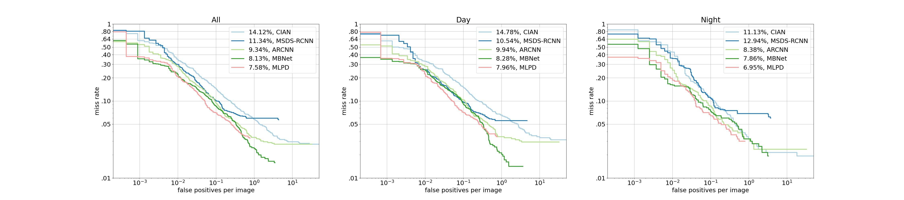

## Evalutation_script

You can evaluate the result files of the models with code.

We draw all the results of state-of-the-art methods in a single figure to make it easy to compare, and the figure represents the miss-rate against false positives per image.

For annotations file, only json is supported, and for result files, json and txt formats are supported.
(multiple `--rstFiles` are supported)

Example)

```bash
$ python evaluation_script/evaluation_script.py \
	--annFile evaluation_script/KAIST_annotation.json \
	--rstFile evaluation_script/MLPD_result.txt \
			  evaluation_script/ARCNN_result.txt \
			  evaluation_script/CIAN_result.txt \
			  evaluation_script/MSDS-RCNN_result.txt \
			  evaluation_script/MBNet_result.txt \
	--evalFigure figure.jpg
```


